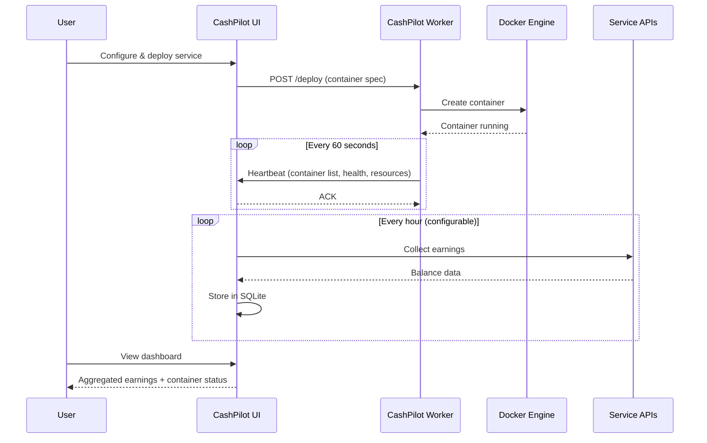

# Architecture

CashPilot uses a split **UI + Worker** architecture. The UI never touches Docker -- all container operations go through workers. This separation is a core design principle and what enables multi-server fleet management.

## Components

| Component | Image | Port | Docker Socket | Purpose |
|-----------|-------|:----:|:-------------:|---------|
| **CashPilot UI** | `ghcr.io/assetforgeai-tech/cashpilot` | 8080 | No | Web dashboard, earnings collection, service catalog, credential storage, scheduling |
| **CashPilot Worker** | `ghcr.io/assetforgeai-tech/cashpilot-worker` | 8081 | **Yes** | Docker container lifecycle, health reporting, heartbeats to UI |

There is **no standalone mode**. Every server that runs Docker containers needs a worker. The UI is a pure dashboard/scheduler -- it can run on any machine, including one without Docker.

## Design Principles

1. **Separation of concerns.** UI handles: dashboard, earnings collection, scheduling, user auth. Workers handle: Docker container lifecycle, health reporting. They never overlap.
2. **Workers must be privileged.** A worker without Docker socket is useless. If you don't need Docker management, just run the UI alone to track earnings.
3. **Single source of truth.** The UI instance is the only one that collects earnings, stores historical data, and serves the dashboard. Workers never collect earnings.
4. **Earnings are never duplicated.** Since only the UI collects, there is no risk of the same account being counted twice.
5. **Workers are stateless satellites.** A worker knows which containers to keep running and the UI URL to report to. It persists only its own fleet key to a local file (no database, no earnings data).
6. **YAML is truth.** Every service lives in `services/{category}/{slug}.yml`. The UI, deployment, docs, and compose export all derive from these files.

## Directory Structure

```
cashpilot/
  app/                      # FastAPI application
    main.py                 # App entrypoint, lifespan, container/fleet/earnings routes
    deps.py                 # Shared auth guards + Jinja2 template environment
    routers/                # Route groups split out of main.py: auth, pages, users
    catalog.py              # Loads YAML service definitions, caches, SIGHUP reload
    orchestrator.py         # Docker SDK: deploy, stop, restart, remove, logs
    database.py             # Async SQLite: earnings, config, deployments, users, workers
    worker_api.py           # Worker REST API: heartbeat, container commands, mini-UI
    setup_token.py          # First-run setup-token gate (owner-account creation)
    metrics.py              # Optional Prometheus metrics (/metrics)
    exchange_rates.py       # Crypto/fiat conversion via CoinGecko + Frankfurter
    collectors/             # Earnings collectors (one module per service, UI only)
      base.py               # BaseCollector ABC + EarningsResult dataclass
      __init__.py           # COLLECTOR_MAP registry + make_collectors() factory
    templates/              # Jinja2: dashboard, setup wizard, catalog, settings
    static/
      css/style.css         # Dark theme (#0f1117 bg, #1a1d26 cards, #3b82f6 accent)
      js/app.js             # Vanilla JS, CP namespace, Chart.js, wizard state machine
  services/                 # YAML service definitions (SINGLE SOURCE OF TRUTH)
    _schema.yml             # Schema documentation
    bandwidth/              # Bandwidth sharing services
    depin/                  # DePIN services
  docs/                     # Documentation and guides
    guides/                 # Per-service setup guides
  Dockerfile                # UI image: multi-stage python:3.14-alpine, su-exec, non-root
  Dockerfile.worker         # Worker image: minimal deps, no collectors/templates
  docker-compose.yml        # Single-server deployment
  docker-compose.fleet.yml  # Multi-server fleet deployment
```

## Data Flow



### Heartbeat (Worker to UI)

Every 60 seconds, each worker sends:

- Container list with status (running, stopped, exited)
- Per-container resource usage (CPU percent, memory MB)
- System info (OS, architecture, hostname, Docker availability)
- Its self-reported URL (explicit `CASHPILOT_WORKER_URL` or an auto-detected fallback)

The UI stores this in its SQLite database and displays it on the fleet dashboard.

### Commands (UI to Worker)

The UI can instruct any worker to:

- **Deploy** a service container (full spec: image, env vars, volumes, ports)
- **Stop**, **restart**, or **remove** a running container
- **Fetch logs** from a container

Commands are sent via REST API calls from the UI to the worker.

### Credential Flow

The worker **never handles or stores credentials**:

1. User configures service credentials in the UI (stored encrypted in SQLite).
2. When deploying, the UI sends the full container spec (including env vars) to the worker.
3. The worker passes the spec to the Docker API. Docker stores the env vars in the container config.
4. For restarts: `docker restart` preserves env vars natively.
5. For full redeploys (remove + create): the UI resends the full spec.

### Earnings Collection

The UI runs scheduled collectors for each configured service:

- **11 automated collectors** fetch balances via service APIs (JWT auth, cookie auth, API keys)
- Results stored in SQLite with native currency (USD, MYST, and other provider currencies)
- Exchange rates fetched from CoinGecko (crypto) and Frankfurter (fiat), cached 15 minutes
- Dashboard converts and displays in the user's preferred currency

## Tech Stack

| Technology | Purpose |
|---|---|
| FastAPI | Backend framework (Python 3.14, async) |
| Jinja2 | Server-rendered HTML templates |
| SQLite | Database (aiosqlite, zero-config, stored in `/data`) |
| Docker SDK for Python | Container lifecycle management via socket |
| PyYAML | Service definition parsing |
| APScheduler | Periodic earnings collection |
| httpx | Async HTTP client for earnings collectors |
| cryptography (Fernet) | At-rest encryption for stored credentials |
| Chart.js | Frontend earnings charts |
| su-exec | Drops root to the `cashpilot` user after entrypoint setup (Dockerfile) |

## Database

SQLite with 400-day data retention. Key tables:

- **earnings** -- Historical earnings per service (timestamp, slug, balance, currency)
- **deployments** -- Active container deployments (slug, container ID, encrypted env vars, status)
- **config** -- Key-value settings and encrypted credentials
- **users** -- Accounts (username, bcrypt password hash, role)
- **user_preferences** -- Per-user onboarding state (setup mode, selected categories, timezone)
- **health_events** -- Container health history (start, stop, crash, check_ok, check_down)
- **workers** -- Fleet worker registry (client ID, name, URL, status, last heartbeat, encrypted per-worker fleet key)

## Security Model

- All credentials encrypted at rest using Fernet symmetric encryption
- Worker-to-UI authentication via per-worker fleet keys (`CASHPILOT_API_KEY` is only the enrollment/bootstrap credential)
- Managed containers run with `--security-opt no-new-privileges`
- Container naming convention: `cashpilot-{slug}` with labels `cashpilot.managed=true`
- UI container has **no** Docker socket access
- Session-based authentication with role system (owner/writer/viewer)

