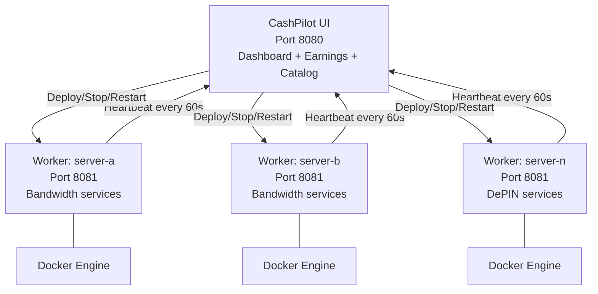

# Multi-Node Fleet Management

For power users running services across multiple servers, CashPilot supports a federated architecture where a single UI aggregates data from workers deployed on each server.

## Topology



## Worker Communication

Workers use **REST HTTP** to communicate with the UI:

- **Heartbeats** (worker → UI): Every 60 seconds, each worker POSTs to `/api/workers/heartbeat` with its container list, system info, and status.
- **Commands** (UI → worker): The UI sends deploy/stop/restart/remove requests to the worker's HTTP API (port 8081).

Workers must be reachable from the UI for commands. The UI must be reachable from workers for heartbeats.

### Importing earnings a client collected on its own

`POST /api/workers/earnings-import` lets a client that has been reading a
provider account by itself — CashPilot Desktop, typically, before it was paired —
hand that history to the UI, so the fleet view shows the complete picture rather
than starting from the day of pairing.

```http
POST /api/workers/earnings-import
Authorization: Bearer <this worker's own key, not the shared enrollment key>
Content-Type: application/json

{
  "client_id": "desktop-macbook",
  "readings": [
    {"slug": "mysterium", "balance": 88.0, "date": "2026-07-01", "currency": "MYST", "fx_rate_usd": 0.41}
  ]
}
```

It answers:

| Status | Meaning |
|---|---|
| `200` | `{"status": "ok", "imported": N, "skipped": [...], "source": "<client_id>"}` |
| `400` | `client_id` was missing or blank |
| `401` | the key is wrong or revoked |
| `403` | this worker is not fully enrolled yet — send a heartbeat first, then retry |
| `422` | the body was rejected: a date that is not a real `YYYY-MM-DD` day, a non-finite `balance` or `fx_rate_usd`, or more than 2000 readings |

Three things about it are deliberate:

- **Each client's readings are stored under their own source, not merged with the
  server's.** Earnings are clamped deltas between consecutive readings of the same
  balance, so interleaving two samplers of one account makes every apparent drop
  clamp to zero and understates the total. Separate series are differenced
  separately and then summed.
- **The source is taken from the authenticated worker, never from the request
  body.** Otherwise any enrolled client could write into another's history, or
  into the server's own.
- **Only a fully enrolled worker may import.** A caller still presenting the
  shared enrollment key gets `403` with instructions to heartbeat first: every
  worker holds that key, and this writes durable money data.

Re-sending the same day updates it rather than appending, so a retried or
repeated import is safe.

`date` must be `YYYY-MM-DD` and a real calendar day. It is not free text: both
delta readers order by it, so a differently shaped date sorts into the wrong
place in its own series and the readings either side then difference against the
wrong neighbour — silently, and only in the earned figure. A request may carry at
most **2000 readings**; send larger histories in chunks.

`balance` and `fx_rate_usd` must be finite. JSON has no `NaN` or `Infinity`, but
Python's parser accepts them, and one `NaN` balance poisons every earned figure
taken from that series — every comparison against it is false, so the clamp
misbehaves silently and the account total becomes `NaN`. They are rejected with
`422`.

Unknown slugs come back in `skipped` as a **distinct, sorted** list, so a year of
one unrecognised platform is reported once rather than 400 times.

## Setting Up the Fleet

### Main server (UI + local worker)

Use `docker-compose.fleet.yml` on your main server to run both the UI and a local worker:

```bash
docker compose -f docker-compose.fleet.yml up -d
```

### Adding remote workers

On each additional server, deploy only a worker pointing back to the UI:

```yaml
services:
  cashpilot-worker:
    image: drumsergio/cashpilot-worker:1.19
    pull_policy: always
    container_name: cashpilot-worker
    # The worker's API is Docker-socket-backed (= root on the host). Bind it to a
    # PRIVATE/VPN interface the UI can reach (e.g. this server's Tailscale IP),
    # never 0.0.0.0 or a public IP. Defaults to loopback if left unset.
    ports:
      - "${CASHPILOT_WORKER_BIND_ADDR:-127.0.0.1}:8081:8081"
    volumes:
      - /var/run/docker.sock:/var/run/docker.sock
      - cashpilot_worker_data:/data
    environment:
      - TZ=Europe/Madrid
      - CASHPILOT_UI_URL=http://main-server:8080
      - CASHPILOT_API_KEY=your-shared-api-key
      - CASHPILOT_WORKER_NAME=server-b
      - CASHPILOT_WORKER_URL=http://server-b:8081
    restart: always
    security_opt:
      - no-new-privileges:true

volumes:
  cashpilot_worker_data:
```

!!! important "CASHPILOT_WORKER_URL"
    Set this to the address the UI should use to reach this worker (e.g. its LAN IP or Tailscale MagicDNS name, port 8081). Without it, the worker auto-detects its own outbound IP, which inside a container is often the Docker bridge address -- unreachable from the UI on another host.

!!! important "API Key"
    The `CASHPILOT_API_KEY` must be identical on the UI and all workers. It is the **enrollment key** each worker uses on first contact; after that, each worker uses its own automatically-issued key.

## Why the UI and worker have separate data directories

The shipped compose files give each its own `/data` volume — `cashpilot_data`
for the UI, `cashpilot_worker_data` for the worker — and that is a security
boundary, not tidiness.

The worker mounts the Docker socket. **That is root on the host**: anything that
can talk to it can start a privileged container and read any file on the
machine. The UI's `/data` holds `cashpilot.db` and `.fernet_key` — the credential
store and the only key that can decrypt it.

Keeping them apart means a compromised or misbehaving worker cannot simply read
every provider password you have entered. It does not make the worker safe to
expose — a worker with the Docker socket is as privileged as the host, which is
why its API binds to loopback by default — but it does stop one component's
blast radius from automatically including the other's secrets.

**`/fleet` is shared, deliberately.** It holds only the enrolment key, which both
sides need by definition.

!!! warning "Do not consolidate them"

    Merging the two into one volume is the obvious simplification when tidying a
    compose file, it looks harmless, and it silently removes the boundary.
    `tests/test_beads_batch_69.py` fails if anyone does — including if the UI
    ever gains the Docker socket, which is the premise the whole argument rests
    on.

## Authentication

CashPilot uses **per-worker fleet keys** (since v1.0.0). The shared `CASHPILOT_API_KEY` is only a bootstrap/enrollment credential; each worker then gets its own key.

- Set `CASHPILOT_API_KEY` on the UI and all workers (or let the UI + co-located worker auto-generate one via the `/fleet` volume).
- **Enrollment:** a worker's first heartbeat authenticates with the shared key. The UI issues that worker its own unique key (stored encrypted on the UI, and returned once). The worker persists it under its private `/data`.
- **After enrollment:** the worker authenticates every heartbeat with its own key, and the UI calls that worker with the same key. The shared key **no longer works** for an enrolled worker — so a leaked worker key only affects that one worker, and no worker can impersonate another.

The fleet key is **never sent to the browser on page load**. The fleet dashboard reveals it only on an explicit, owner-only action (the **Reveal API Key** button), and copy-to-clipboard fetches it the same way.

!!! warning "Security"
    Keys grant container-management access — treat them as sensitive credentials, and never expose worker APIs (port 8081) to the public internet. See the [v1.0.0 upgrade guide](upgrade-v1.md) if you are moving an existing fleet.

## Fleet Dashboard

The UI's fleet dashboard shows:

- All connected workers with online/offline status and "last seen" timestamps
- Per-worker container list with health, CPU, memory, and uptime
- Remote action buttons (deploy, stop, restart, remove) targeting any worker
- Aggregated earnings across all workers

Services running on multiple workers show expandable rows with per-instance details. The main row displays averaged CPU/memory (prefixed with `~`), and sub-rows show individual worker values.

## Cross-Subnet Workers

If the worker and UI are on different subnets (e.g., connected via Tailscale):

1. The UI server must advertise its subnet: `tailscale set --advertise-routes=<UI-subnet>`
2. The worker server must accept routes: `tailscale set --accept-routes=true`
3. The worker uses the UI's LAN IP in `CASHPILOT_UI_URL` (not the Tailscale IP)

## Offline Handling

If a worker goes offline (no heartbeat for 180 seconds):

- The UI marks the worker as offline
- Historical earnings and health data is retained
- The worker reconnects automatically when back online
- Container status updates resume immediately after reconnection

## Environment Variables Reference

### UI

| Variable | Default | Description |
|----------|---------|-------------|
| `CASHPILOT_API_KEY` | *(auto-generated via /fleet volume)* | Shared secret for worker authentication |
| `CASHPILOT_SECRET_KEY` | *(auto-generated)* | Signing key for login sessions. Persisted at `/data/.secret_key`. **Does not encrypt credentials** |
| `CASHPILOT_ENCRYPTION_KEY` | *(auto-generated)* | Fernet key encrypting stored credentials at rest. Persisted at `/data/.fernet_key`; adopted only when that file is absent |
| `CASHPILOT_ADMIN_API_KEY` | -- | Optional separate key granting full owner access (for integrations) |
| `CASHPILOT_READONLY_API_KEY` | -- | Optional read-only key for dashboards. Reporting GETs only; refused everywhere else |
| `CASHPILOT_WORKER_URL_POLICY` | `permissive` | Worker URL validation policy: `permissive` (LAN + Tailscale work out of the box) or `strict` (allowlist only) |
| `CASHPILOT_WORKER_ALLOWED_HOSTS` | -- | Comma-separated CIDRs and `*.suffix` hostnames allowed in `strict` mode, e.g. `192.168.10.0/24,100.64.0.0/10,*.ts.net` |
| `CASHPILOT_WORKER_ALLOW_METADATA` | `false` | Escape hatch to permit cloud-metadata IPs as worker targets (leave `false`) |
| `CASHPILOT_NTFY_URL` | -- | ntfy topic URL for out-of-band alerts, e.g. `https://ntfy.sh/my-topic` |
| `CASHPILOT_WEBHOOK_URL` | -- | Generic endpoint receiving alert JSON (`title`, `message`, `kind`, `subject`) |
| `CASHPILOT_TELEGRAM_BOT_TOKEN` | -- | Telegram bot token (needs `CASHPILOT_TELEGRAM_CHAT_ID` too) |
| `CASHPILOT_TELEGRAM_CHAT_ID` | -- | Telegram chat to send alerts to |

### Alerts

Passive income is unattended, so an alert that only appears in an open browser tab is an alert nobody sees. Collector failures are **persisted** (they survive a restart and repopulate the notification bell) and, if any target above is configured, pushed out-of-band.

Notifications fire **only the first time** a particular failure appears — a collector that has been broken for a week does not notify every hour. When the service recovers, its stored alert is cleared, so a later failure counts as new and notifies again. With no target configured the feature is entirely inert.

### Worker

| Variable | Required | Default | Description |
|----------|:--------:|---------|-------------|
| `CASHPILOT_UI_URL` | Yes | -- | URL of the CashPilot UI (e.g. `http://192.168.10.100:8080`) |
| `CASHPILOT_API_KEY` | Yes | -- | Must match the UI's API key |
| `CASHPILOT_WORKER_NAME` | No | *(hostname)* | Display name for this worker. Recommended on Docker workers: without it the name is the container hostname, so it changes on every recreate and the dashboard label churns -- see [Worker identity](#worker-identity) |
| `CASHPILOT_WORKER_URL` | No | *(auto-detected)* | URL the UI uses to reach this worker. Set explicitly for remote/cross-host workers -- auto-detection can report an unreachable address |
| `CASHPILOT_PORT` | No | `8081` | Port the worker **advertises** to the UI. It does *not* change the listen port, which is fixed by the image's `CMD` — see the [configuration reference](configuration.md) |
| `CASHPILOT_ALLOWED_VOLUME_ROOTS` | No | *(none)* | Colon-separated host directories this worker may bind-mount despite sitting under a blocked system root -- see [Volume mounts](#volume-mounts) |
| `CASHPILOT_PIDS_LIMIT` | No | `512` | Max processes a deployed service container may create. Raise only if a service legitimately needs more. An unparseable or non-positive value falls back to the default |
| `CASHPILOT_WORKER_NETWORK` | No | *(detected)* | `residential` or `hosting`. Overrides the hardware-based guess -- see [Egress IP and per-IP limits](#egress-ip-and-per-ip-limits) |
| `CASHPILOT_EGRESS_DETECT` | No | on | Set to `off` to stop this worker looking up its own public IP. The fleet then reports its exit as undetermined |
| `CASHPILOT_EGRESS_IP` | No | -- | State this worker's public IP directly instead of looking it up. Must be a public address; a LAN or tailnet address is rejected |
| `CASHPILOT_EGRESS_IP_URL` | No | -- | Use your own IP-echo endpoint (must return a bare IP) instead of the public ones |

### Egress IP and per-IP limits

Providers count devices per **IP address**, not per machine. Some providers
treat a second active device on a network as "network overused", and others
document that extra devices behind one IP share a single daily cap. Two workers
in one house are two machines on your dashboard and **one customer** to the
provider, so the second one usually earns nothing.

Each worker therefore reports the public address it leaves the internet through,
and the UI can group the fleet by that address (`/api/fleet/egress-groups`)
rather than by host. Deploying a service to a machine that shares an address
with one already running it is called out before the deploy, by name.

Three things worth knowing about how this behaves:

- **A worker whose exit could not be determined is reported as undetermined,
  never as sharing.** No warning is produced for it at all. That is deliberate:
  a wrong conflict warning is worse than none.
- **Private addresses are ignored.** A LAN or tailnet (`100.64/10`) address means
  detection failed, not that the machine exits there.
- **A service with no documented per-IP limit is treated as unknown, not
  unlimited.** You are told to check the provider's terms rather than reassured.

Detection is local where it can be. The "is this a hosted machine?" hint comes
from the machine's own hardware identifiers, so nothing is sent anywhere and it
works offline; a plain hypervisor such as QEMU or VMware is **not** treated as
hosting, because a VM on a home server is a residential connection.

The public-IP lookup is the one outbound call CashPilot makes purely to learn
about your setup. It is a single request per hour to a public IP-echo service.
Turn it off with `CASHPILOT_EGRESS_DETECT=off`, point it at your own endpoint
with `CASHPILOT_EGRESS_IP_URL`, or skip it entirely by stating the address with
`CASHPILOT_EGRESS_IP`.

### Volume mounts

A worker refuses to bind-mount host paths under system roots such as `/`, `/etc`, `/var/run` (which covers the Docker socket), `/var/lib/docker` and `/mnt`, so a fleet-key holder cannot mount the host filesystem or a co-located app's secrets into a service container.

A few services may legitimately need a directory under one of those roots. Opt in exactly that service directory:

```yaml
environment:
  - CASHPILOT_ALLOWED_VOLUME_ROOTS=/mnt/user/cashpilot-service
```

Multiple paths are colon-separated. An entry must clear two gates:

- **Never a system path.** Anything resolving under `/etc`, `/root`, `/proc`, `/sys`, `/dev`, `/boot`, `/usr`, `/bin`, `/sbin`, `/lib`, `/run` or `/var` is refused **at any depth** — so `/run/docker.sock`, `/var/lib/docker/...` and `/etc/shadow` cannot be opted in.
- **Specific enough to be a service directory.** It must sit at least two components below the root it belongs to, so `/mnt/user/cashpilot-service` is accepted while `/mnt` and `/mnt/user` (the entire Unraid array) are not.

Relative paths are refused, and refusals are logged with the reason.

!!! warning "Residual risk — allowlist only directories you trust"
    The worker resolves paths in its **own** mount namespace and cannot see the host filesystem, so a symlink created *inside* an allowlisted directory by the service that owns it resolves differently here than in the Docker daemon. Only allowlist a directory whose contents you are willing to treat as trusted, and prefer a dedicated service path over a shared one.

### Deployed-container hardening

Service containers are third-party and closed-source, so the worker deploys them with the minimum kernel surface: **all capabilities dropped**, then only the ones that service's own catalog entry declares added back. They also get `no-new-privileges`, a PID limit, and are **never** privileged — `privileged` is refused by spec validation and is not an accepted argument in the deploy path at all.

If you add a service that genuinely needs a capability, declare it in that service's YAML (`docker.cap_add`). The check is **per service**: a slug may only request the capabilities its own catalog entry declares, so adding one to one service grants nothing to the others. Today that is Mysterium's `NET_ADMIN` and Bitping's `NET_RAW`.

### Worker identity

The UI keys each worker's row -- and its per-worker fleet key -- on a `client_id`,
persisted at `/data/.worker_id`. That file is written on first run and reused forever,
so a worker keeps its row across restarts and upgrades.

Inside a container `socket.gethostname()` is the first 12 hex characters of the container
ID, regenerated every time the container is recreated -- which is exactly what an image
bump does. A name of that shape is therefore never adopted as an identity: a worker that
finds no `/data/.worker_id` generates and persists a random one instead.

Setting **`CASHPILOT_WORKER_NAME`** keeps the dashboard label stable across recreates
(otherwise it follows the container hostname and churns on every upgrade), and gives a
worker enrolled before `/data/.worker_id` existed a durable identity to migrate on.

!!! warning "Symptom: heartbeats 401 after an upgrade"
    If a worker's identity changes, it keeps its valid per-worker key but presents it
    under an unknown `client_id`, and the UI correctly refuses it. Every heartbeat then
    returns `401 Unauthorized` and the worker drops out of the fleet -- while its service
    containers keep running and earning, so nothing else looks wrong.

    To reclaim the existing row: stop the worker, write the `client_id` the UI lists for
    it into `/data/.worker_id` (owned/readable by the container user), start it again,
    and set `CASHPILOT_WORKER_NAME` so it cannot recur. The worker logs this remediation
    itself after three consecutive rejections.

### Worker URL Validation

The UI validates every worker URL before contacting it (the URL is fetched with the fleet bearer token attached, so an unchecked URL is an SSRF risk). Cloud-metadata addresses and loopback/link-local ranges are **always blocked**, and resolved hostnames are re-checked against the same rules to guard against DNS rebinding.

- **`permissive`** (default): LAN (RFC1918) and Tailscale (CGNAT `100.64.0.0/10`) workers keep working with no configuration. Only the always-blocked ranges are rejected.
- **`strict`**: workers must match `CASHPILOT_WORKER_ALLOWED_HOSTS`. Entries are either CIDRs (`192.168.10.0/24`) or hostname suffixes (`*.ts.net`).

!!! important "Tailscale in strict mode"
    If you use Tailscale and enable `strict` mode, include `100.64.0.0/10` in `CASHPILOT_WORKER_ALLOWED_HOSTS` (and/or `*.ts.net` for MagicDNS names). Without it, Tailscale workers are rejected.
