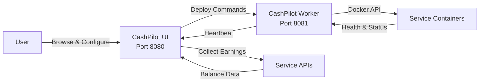

# Getting Started

## Prerequisites

- **Docker** and **Docker Compose** installed on your server
- A Linux, macOS, or Windows host (amd64 or arm64)
- At least 1 GB of RAM available for CashPilot + managed services

## Quick Start

### 1. Clone and launch

```bash
git clone https://github.com/assetforgeai-tech/CashPilot.git
cd CashPilot
docker compose up -d
```

This starts two containers:

| Container | Port | Purpose |
|-----------|------|---------|
| **cashpilot-ui** | 8080 | Web dashboard, earnings collection, service catalog |
| **cashpilot-worker** | 8081 | Docker agent that deploys and monitors service containers |

### 2. Open the dashboard

Navigate to [http://localhost:8080](http://localhost:8080) in your browser. Since no account exists yet, you'll be redirected to onboarding and then to the registration form.

!!! warning "First-run setup token required"
    On first start, CashPilot generates a one-time setup token and prints it to the **cashpilot-ui** container logs:

    ```bash
    docker compose logs cashpilot-ui
    ```

    Look for a line like:

    ```
    FIRST-RUN SETUP: no account exists yet. Open /register and enter this
    one-time setup token to create the owner account: <token>
    ```

    Copy that token into the **Setup Token** field on the registration form to create the first (owner) account. It's only ever shown in the logs — never in a URL — and is discarded permanently once the owner account exists.

### 3. Browse the service catalog

Filter providers by category (bandwidth or DePIN), view earning estimates, and check requirements before deploying.

### 4. Sign up for services

Each service card has a signup link. Create accounts on the services you want to run.

### 5. Enter credentials and deploy

The setup wizard collects only the credentials each service needs (email/password, API token, etc.). Click **Deploy** and CashPilot handles the rest -- pulling images, creating containers, and starting health monitoring.

## How It Works



1. **You configure** services through the web UI -- pick a service, enter credentials, click deploy.
2. **The UI sends** the container spec (image, env vars, volumes) to the worker via REST API.
3. **The worker creates** the Docker container and starts monitoring its health.
4. **The worker reports** container status back to the UI every 60 seconds via heartbeats.
5. **The UI collects** earnings from service APIs on a configurable schedule (default: every hour).
6. **The dashboard** shows aggregated earnings, per-service breakdowns, and container health.

## Configuration

### UI Environment Variables

| Variable | Default | Description |
|----------|---------|-------------|
| `TZ` | `UTC` | Timezone for scheduling and display |
| `CASHPILOT_SECRET_KEY` | *(auto-generated)* | Signing key for login sessions. Persisted at `/data/.secret_key`. **Does not encrypt credentials** |
| `CASHPILOT_ENCRYPTION_KEY` | *(auto-generated)* | Fernet key encrypting stored credentials at rest. Persisted at `/data/.fernet_key`. Adopted only when that file is absent, so set it only to restore a backup |
| `CASHPILOT_API_KEY` | -- | Shared secret between UI and workers for API authentication |
| `CASHPILOT_COLLECT_INTERVAL` | `60` | Minutes between earnings collection cycles |
| `CASHPILOT_BIND_ADDR` | `127.0.0.1` | Host interface the UI port is published on. **Loopback by default** — the dashboard can command the Docker-socket worker, so it is not exposed to your network out of the box. Set a specific IP (e.g. a Tailscale/VPN address) or `0.0.0.0` to expose it, or (preferred) run an authenticating reverse proxy in front |

The UI's web port inside the container is fixed at `8080` (set via the container's `CMD`); `CASHPILOT_BIND_ADDR` controls only which host interface it is published on.

### Worker Environment Variables

| Variable | Default | Description |
|----------|---------|-------------|
| `TZ` | `UTC` | Timezone |
| `CASHPILOT_UI_URL` | -- | URL of the UI container, e.g. `http://cashpilot-ui:8080` |
| `CASHPILOT_API_KEY` | -- | Must match the UI's API key |
| `CASHPILOT_WORKER_NAME` | *(hostname)* | Display name for this worker in the fleet dashboard |
| `CASHPILOT_WORKER_URL` | *(auto-detected)* | URL the UI uses to reach this worker, e.g. `http://192.168.10.50:8081`. Set explicitly for cross-host fleets — auto-detection can report an unreachable container-internal IP |
| `CASHPILOT_WORKER_BIND_ADDR` | `127.0.0.1` | Host interface the worker's Docker-socket API port is published on. **Loopback by default.** The worker API can deploy/stop any container (= root on the host), so for a remote worker bind a private/VPN interface (e.g. a Tailscale IP), **never** a public IP |
| `CASHPILOT_PORT` | `8081` | Port the worker **advertises** to the UI. It does *not* change the listen port, which is fixed by the image's `CMD` — see the [configuration reference](configuration.md) |

### Docker Compose Example

```yaml
--8<-- "docker-compose.yml"
```

!!! note "This is the real file"

    The block above is included verbatim from `docker-compose.yml` in the
    repository, so it cannot drift from what actually ships. Earlier, a
    hand-copied version of it published the worker's Docker-socket API on every
    interface and pinned `:latest` — both of which the
    [security defaults](security-defaults.md) page tells you not to do.

!!! warning "Docker Socket Access"
    The worker container requires access to `/var/run/docker.sock` to manage service containers. This grants the worker significant privileges on the host. Run CashPilot on a dedicated machine or VLAN for best security.

!!! tip "Secret Key Persistence"
    Credentials are encrypted with `CASHPILOT_ENCRYPTION_KEY`, **not** `CASHPILOT_SECRET_KEY` — the latter only signs login sessions. The encryption key is auto-generated on first run and stored at `/data/.fernet_key`. **Back that file up.** If the volume is recreated without it, a fresh key is generated and every stored credential becomes permanently unreadable. Setting `CASHPILOT_ENCRYPTION_KEY` is for restoring that backup; the key file always wins, so setting it on a healthy instance changes nothing.

!!! tip "Passwords and secrets in the UI"
    Change your own password any time from the avatar menu -> **Change password** (available to all roles); this signs out your other sessions. In **Settings**, stored secrets are write-only: enter a value to change it, or leave the field blank to keep the existing one. Saved credentials are never sent back to the browser.

## Updating CashPilot

The shipped compose files use a floating **major.minor** tag, so updating to the
latest patch in that series is just a pull + recreate:

```bash
docker compose pull
docker compose up -d
```

`docker compose pull` fetches the newest published image in the pinned series and `up -d` recreates
only the containers whose image changed. The shipped compose files set
`pull_policy: always`, so even a bare `docker compose up -d` will check that
series for a newer patch first.

!!! note "You do **not** need to rebuild"
    CashPilot ships prebuilt multi-arch images on GitHub Container Registry
    ([`ghcr.io/assetforgeai-tech/cashpilot`](https://github.com/assetforgeai-tech/CashPilot/pkgs/container/cashpilot),
    [`ghcr.io/assetforgeai-tech/cashpilot-worker`](https://github.com/assetforgeai-tech/CashPilot/pkgs/container/cashpilot-worker)).
    `docker compose build` / `--build` is only relevant if you deliberately
    build from source with `docker-compose.build.yml`. For normal installs,
    `pull` + `up -d` is the complete and correct update procedure.

### Pinning a specific version

To stay on one exact patch instead of following the compose file's major.minor
series, replace the tag (e.g. `ghcr.io/assetforgeai-tech/cashpilot:1.1.0`) and remove
`pull_policy: always`. Browse available tags on
[GitHub Container Registry](https://github.com/assetforgeai-tech/CashPilot/pkgs/container/cashpilot). The minor
tag (e.g. `:1.1`) tracks the latest patch within that minor series.

### Automating updates (optional)

If you want hands-off updates, point a scheduler at the same two commands —
for example a daily cron entry:

```cron
0 4 * * *  cd /path/to/cashpilot && docker compose pull && docker compose up -d
```

Or run an auto-updater such as [Watchtower](https://containrrr.dev/watchtower/)
or [Diun](https://crazymax.dev/diun/) against the CashPilot containers. These
are entirely optional — CashPilot does not bundle an updater.

## Supported Services

CashPilot tracks **16 providers** across two active categories:

- **Bandwidth Sharing** (14 providers) -- Share your internet bandwidth for passive income
- **DePIN** (2 providers) -- Decentralized physical infrastructure networks

Of these, **15 providers** retain Docker/runtime catalog metadata, and **9 collectors** use the shared collector registry. EarnApp uses its separate account-scoped collector and a platform-restricted runtime: official Linux x64 runs in the dedicated Ubuntu LXD lane, while MacOS/iOS emulation and generic Docker deploy remain disabled. Providers without collection support still need dashboard/manual verification for earnings.

The server-side Settings page is where you keep provider runtime assets, collector secrets, dashboard/session credentials, proxy policy, MYST default password, NKN beneficiary address, and auto-deploy policy. NKN is direct-only: the worker bootstrap discovers public IPv4 slots and CashPilot assigns one wallet and node per ready slot. The command in `client command setup script.txt` is the canonical one-command onboarding path; it defaults to the fork `main` branch, invokes the tracked host bootstrap, and installs the NKN helper/cache prerequisites without deploying a provider. Set `CASHPILOT_BRANCH` before running it when a reviewed ref must be pinned.

Browse the full catalog in the [Service Guides](guides/README.md) section.

## Next Steps

- [Architecture](architecture.md) -- Understand the UI + Worker split design
- [Fleet Management](fleet.md) -- Deploy across multiple servers
- [Service Guides](guides/README.md) -- Detailed setup instructions for each service
